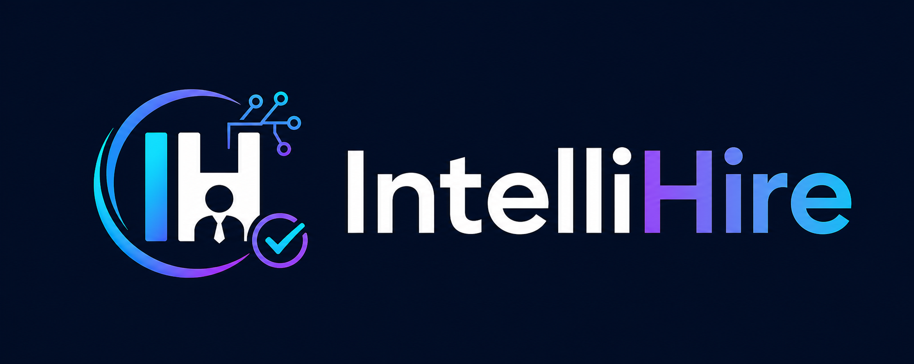
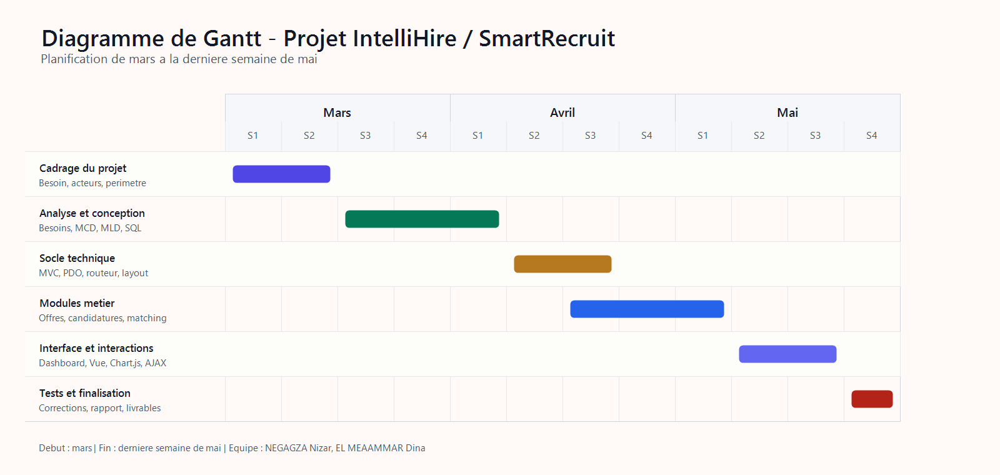
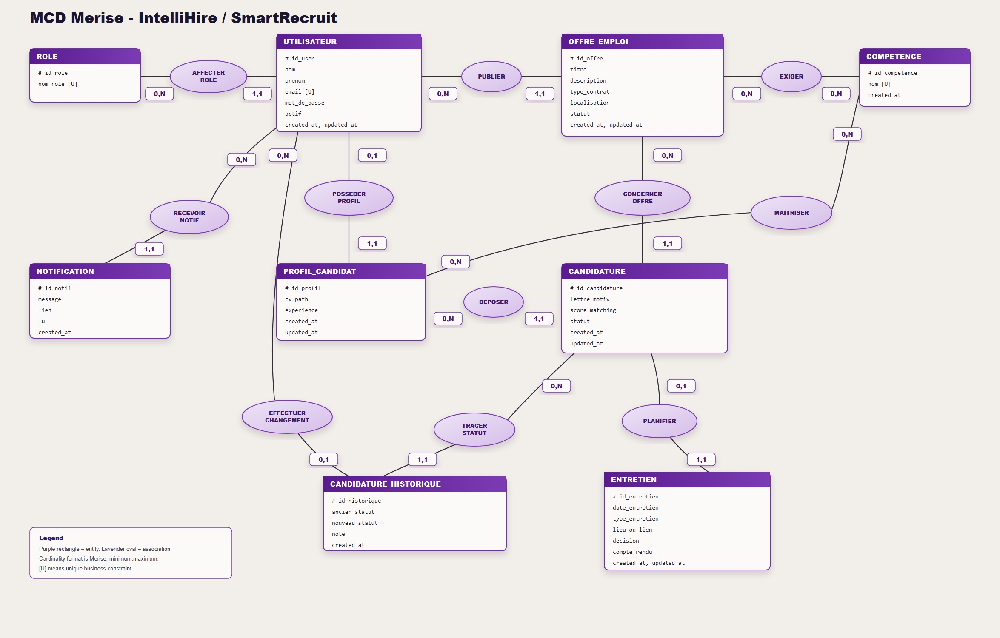
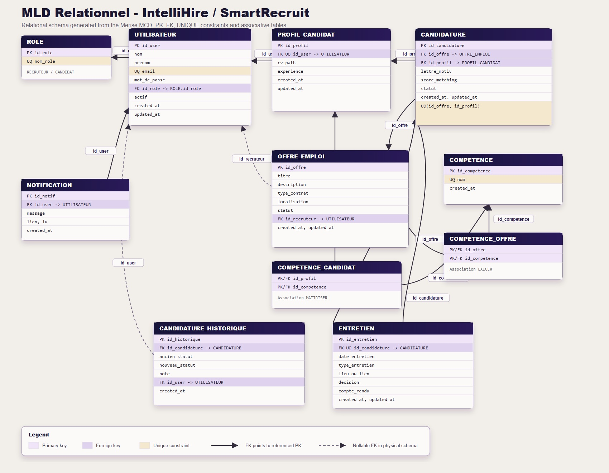
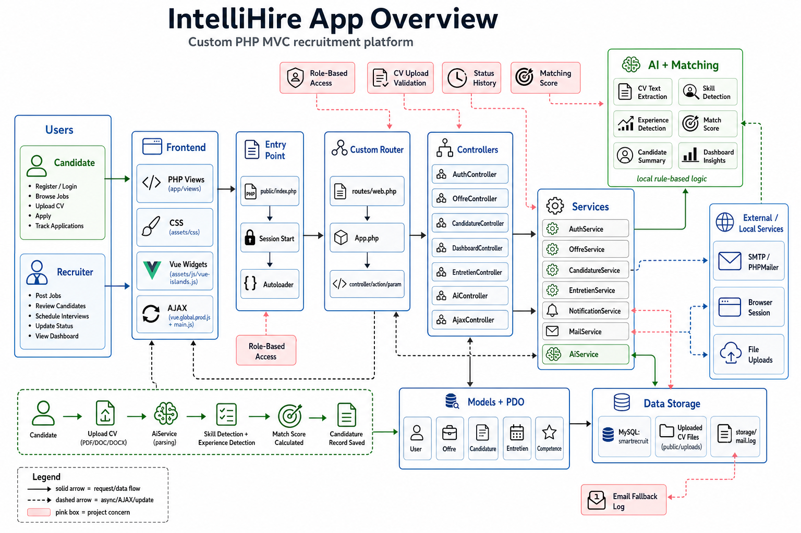

# Rapport fonctionnel - IntelliHire / SmartRecruit

**Projet :** Plateforme web de gestion intelligente du recrutement  
**Nom du dépôt :** SmartRecruit  
**Nom de l'application :** IntelliHire  
**Technologies principales :** PHP, MySQL, HTML/CSS, JavaScript, Vue.js, Chart.js  
**Année universitaire :** à compléter  
**Encadrant :** à compléter  

---

## Présentation de l'équipe

**Tableau 1 - Membres de l'équipe projet**

| Membre | Rôle | Responsabilités principales |
|---|---|---|
| NEGAGZA Nizar | Développeur Backend / conception base de données | Architecture PHP MVC, contrôleurs, services, modèles, règles métier, schéma MySQL, MCD/MLD. |
| EL MEAAMMAR Dina | Développeuse Frontend / analyste fonctionnelle | Analyse des besoins, interfaces utilisateur, intégration des vues, ergonomie, tests fonctionnels et documentation. |

---

## Remerciements

Nous remercions notre encadrant pour son accompagnement, ses remarques et ses orientations tout au long de la réalisation de ce projet. Nous remercions également l'ensemble des enseignants et intervenants qui nous ont apporté les bases nécessaires en analyse, conception, développement web et bases de données.

Nous exprimons aussi notre gratitude envers les personnes ayant contribué, directement ou indirectement, à la clarification du besoin fonctionnel, aux tests de l'application et à l'amélioration de l'expérience utilisateur.

---

## Résumé

IntelliHire, développé dans le cadre du projet SmartRecruit, est une application web dédiée à la gestion du processus de recrutement. Elle permet aux recruteurs de publier des offres d'emploi, de suivre les candidatures, d'analyser les profils, de planifier des entretiens et de consulter un tableau de bord synthétique. Les candidats peuvent consulter les offres publiées, postuler, téléverser leur CV, déclarer leurs compétences et suivre l'évolution de leurs candidatures.

L'application se distingue par un mécanisme de matching entre les compétences demandées par une offre et les compétences possédées par un candidat. Ce score prend également en compte l'expérience du candidat à travers une formule pondérée. Le projet intègre aussi des fonctionnalités d'assistance locale de type IA : génération d'insights pour le tableau de bord, synthèse d'une candidature, extraction approximative de compétences depuis un CV et proposition de questions d'entretien.

Le système repose sur une architecture MVC simple en PHP, une base de données MySQL, des vues PHP, du JavaScript côté client, des composants Vue.js légers et des graphiques Chart.js. La modélisation des données suit une démarche Merise avec un MCD, un MLD et un schéma physique SQL.

**Mots-clés :** recrutement, candidature, offre d'emploi, matching, PHP, MySQL, MVC, Merise, IA locale.

---

## Abstract

IntelliHire, built as part of the SmartRecruit project, is a web-based recruitment management platform. It enables recruiters to publish job offers, manage applications, evaluate candidate profiles, schedule interviews and monitor recruitment activity through a dashboard. Candidates can browse published offers, apply online, upload their resume, declare skills and track the status of their applications.

The application includes a matching mechanism that compares required job skills with candidate skills and combines this result with the candidate's professional experience. It also provides local AI-like assistance features such as dashboard insights, candidate summaries, basic resume parsing and interview question suggestions.

The system is implemented with a lightweight PHP MVC architecture, a MySQL database, PHP views, client-side JavaScript, Vue.js islands and Chart.js visualizations. Data modeling follows the Merise method with conceptual, logical and physical database models.

**Keywords:** recruitment, application tracking, job offer, matching, PHP, MySQL, MVC, Merise, local AI.

---

## Liste des acronymes

**Tableau 2 - Acronymes**

| Acronyme | Signification |
|---|---|
| AJAX | Asynchronous JavaScript and XML |
| API | Application Programming Interface |
| CRUD | Create, Read, Update, Delete |
| CSS | Cascading Style Sheets |
| CV | Curriculum Vitae |
| FK | Foreign Key / clé étrangère |
| HTML | HyperText Markup Language |
| IA | Intelligence artificielle |
| MCD | Modèle conceptuel de données |
| MLD | Modèle logique de données |
| MVC | Model View Controller |
| PDO | PHP Data Objects |
| PHP | PHP Hypertext Preprocessor |
| PK | Primary Key / clé primaire |
| SQL | Structured Query Language |
| SMTP | Simple Mail Transfer Protocol |
| UI | User Interface |
| UX | User Experience |
| WAMP | Windows, Apache, MySQL, PHP |

---

## Liste des figures

| N° | Figure | Emplacement |
|---|---|---|
| Figure 1 | Logo de l'application IntelliHire | `public/assets/img/intellihire-logo.png` |
| Figure 2 | Vue générale de l'application | `public/assets/img/intellihire-app-overview.png` |
| Figure 3 | Modèle conceptuel de données Merise | `docs/mcd_merise.jpg` |
| Figure 4 | Modèle logique de données Merise | `docs/mld_merise.jpg` |
| Figure 5 | Diagramme de Gantt du projet | `docs/diagramme_gantt.png` |
| Figure 6 | Tableau de bord recruteur | Capture à insérer depuis l'application |
| Figure 7 | Catalogue des offres d'emploi | Capture à insérer depuis l'application |
| Figure 8 | Détail d'une candidature avec score de matching | Capture à insérer depuis l'application |
| Figure 9 | Gestion des entretiens | Capture à insérer depuis l'application |

---

## Liste des tableaux

| N° | Titre |
|---|---|
| Tableau 1 | Membres de l'équipe projet |
| Tableau 2 | Acronymes |
| Tableau 3 | Planification du projet |
| Tableau 4 | Étude de l'existant |
| Tableau 5 | Besoins fonctionnels |
| Tableau 6 | Besoins non fonctionnels |
| Tableau 7 | Identification des acteurs |
| Tableau 8 | Dictionnaire de données |
| Tableau 9 | Règles de gestion |
| Tableau 10 | Outils et technologies utilisés |

---

## Table des matières

1. Introduction générale  
2. Chapitre 1 : Contexte général du projet  
   1.1 Introduction  
   1.2 Présentation du projet  
   1.2.1 Cadre du projet  
   1.2.2 Objectifs du projet  
   1.2.3 Méthodologie de gestion de projet  
   1.2.4 Présentation de l'équipe  
   1.2.5 Planification du projet  
   1.3 Conclusion  
3. Chapitre 2 : Analyse et conception  
   2.1 Introduction  
   2.2 Étude de l'existant  
   2.3 Étude des besoins fonctionnels  
   2.4 Étude des besoins non fonctionnels  
   2.5 Identification des acteurs  
   2.6 Modélisation du système  
   2.6.1 Dictionnaire de données  
   2.6.2 Règles de gestion  
   2.6.3 Modèle conceptuel de données  
   2.6.4 Modèle logique de données  
   2.7 Conclusion  
4. Chapitre 3 : Réalisation  
   3.1 Introduction  
   3.2 Architecture logicielle  
   3.3 Présentation des outils utilisés  
   3.4 Implémentation  
   3.4.1 Développement Backend  
   3.4.2 Développement Frontend  
   3.5 Présentation de l'application  
   3.6 Conclusion  
5. Conclusion générale et perspectives  
6. Références  

---

# Introduction générale

Le recrutement constitue une activité stratégique pour toute organisation. Il ne s'agit pas uniquement de publier une offre et de collecter des CV : le recruteur doit centraliser les candidatures, comparer les profils, suivre les étapes du processus, planifier les entretiens et garder une trace des décisions. Lorsque ces opérations sont réalisées avec des outils dispersés, par exemple des fichiers tableurs, des boîtes e-mail ou des dossiers partagés, le suivi devient rapidement difficile.

Le projet SmartRecruit répond à cette problématique par la réalisation d'une plateforme web appelée IntelliHire. Cette application propose un espace unifié pour gérer les offres d'emploi, les candidats, les candidatures, les entretiens, les notifications et les indicateurs de pilotage. Elle offre deux parcours principaux : un parcours recruteur et un parcours candidat.

Le parcours recruteur permet de créer et administrer les offres, consulter les candidatures reçues, modifier leur statut, planifier des entretiens, enregistrer les décisions et visualiser l'activité à travers un tableau de bord. Le parcours candidat permet de consulter les offres publiées, postuler en ligne, téléverser un CV, renseigner l'expérience et suivre ses candidatures.

Le système intègre également une logique de matching entre une offre et un profil candidat. Ce score facilite la priorisation des candidatures en combinant les compétences déclarées avec l'expérience professionnelle. Des modules d'aide locale inspirés de l'IA complètent le projet : résumé de candidature, extraction de compétences depuis un CV, insights sur le pipeline et propositions de questions d'entretien.

Ce rapport présente le contexte, l'analyse fonctionnelle, la conception des données et la réalisation technique de l'application.

---

# Chapitre 1 : Contexte général du projet

## 1.1 Introduction

Ce chapitre présente le cadre général du projet, ses objectifs, l'organisation de l'équipe et la planification adoptée. Il permet de comprendre le besoin auquel répond l'application IntelliHire et la démarche suivie pour transformer ce besoin en solution web opérationnelle.

## 1.2 Présentation du projet

IntelliHire est une plateforme web de gestion du recrutement développée en PHP avec une base de données MySQL. Elle centralise les principales étapes du cycle de recrutement : publication d'offres, dépôt de candidatures, calcul de correspondance, gestion des statuts, planification des entretiens, notifications et tableaux de bord.

Le dépôt local du projet porte le nom `smartrecruit`, tandis que l'application affichée dans l'interface porte le nom IntelliHire. Cette distinction reflète le nom de travail du projet et le nom produit présenté à l'utilisateur final.



## 1.2.1 Cadre du projet

Le projet s'inscrit dans le cadre d'un travail académique de conception et de développement d'une application web. Il mobilise plusieurs compétences : analyse fonctionnelle, modélisation Merise, conception d'une base de données relationnelle, programmation PHP, intégration HTML/CSS, JavaScript côté client et structuration MVC.

Le système est prévu pour un environnement local de type WAMP, avec Apache, PHP et MySQL. Le fichier `database/schema.sql` contient le schéma complet de la base `intellihire`, les contraintes relationnelles et un jeu de données de démonstration.

## 1.2.2 Objectifs du projet

Les objectifs fonctionnels principaux sont les suivants :

- permettre l'inscription et l'authentification des utilisateurs ;
- distinguer les rôles `RECRUTEUR` et `CANDIDAT` ;
- permettre aux recruteurs de créer, modifier, publier, clôturer ou archiver des offres d'emploi ;
- permettre aux candidats de consulter les offres publiées et de postuler ;
- gérer les profils candidats, leurs compétences, leur expérience et leur CV ;
- calculer un score de matching entre une offre et un candidat ;
- permettre le suivi des candidatures par statut ;
- conserver l'historique des changements de statut ;
- planifier et gérer les entretiens ;
- notifier les utilisateurs des événements importants ;
- envoyer des e-mails ou les journaliser en environnement de développement ;
- fournir un tableau de bord avec indicateurs, graphiques et insights.

Les objectifs techniques sont les suivants :

- appliquer une architecture MVC simple et lisible ;
- utiliser PDO pour sécuriser l'accès aux données ;
- organiser le code en contrôleurs, services, modèles et vues ;
- produire une base de données relationnelle cohérente ;
- séparer la logique métier de l'affichage ;
- améliorer l'expérience utilisateur avec JavaScript, Vue.js et Chart.js.

## 1.2.3 Méthodologie de gestion de projet

La démarche adoptée est une méthodologie agile simplifiée. Le projet a été découpé en modules fonctionnels courts : authentification, offres, candidatures, matching, entretiens, tableau de bord, notifications et documentation. Chaque module a été conçu, développé puis intégré progressivement.

Cette méthode permet d'obtenir rapidement une version utilisable, puis de l'enrichir par itérations. Elle favorise aussi les tests réguliers : chaque fonctionnalité peut être vérifiée avant de passer à la suivante.

Les pratiques retenues sont :

- identification initiale des acteurs et besoins ;
- modélisation des données avant implémentation ;
- développement incrémental par modules ;
- validation par scénarios utilisateurs ;
- amélioration de l'interface après intégration fonctionnelle ;
- documentation progressive du modèle de données et du fonctionnement.

## 1.2.4 Présentation de l'équipe

L'équipe projet est composée de deux membres : NEGAGZA Nizar et EL MEAAMMAR Dina. Les responsabilités ont été réparties de manière complémentaire tout en gardant une collaboration continue sur les choix fonctionnels, la validation des écrans et la cohérence globale de l'application.

- NEGAGZA Nizar s'est principalement chargé de l'architecture backend, de la logique métier, des modèles, des services, de la base de données MySQL et de la modélisation Merise.
- EL MEAAMMAR Dina s'est principalement chargée de l'analyse fonctionnelle, de l'intégration frontend, de l'ergonomie des interfaces, des tests fonctionnels et de la rédaction documentaire.

## 1.2.5 Planification du projet

**Tableau 3 - Planification du projet**

| Phase | Période | Activités principales | Livrables |
|---|---|---|---|
| Phase 1 : Cadrage | S1-S2 mars | Analyse du besoin, identification des acteurs, définition du périmètre. | Cahier fonctionnel initial, liste des modules. |
| Phase 2 : Analyse et conception | S3 mars-S1 avril | Modélisation Merise, dictionnaire de données, règles de gestion, schéma SQL. | MCD, MLD, fichier `schema.sql`. |
| Phase 3 : Socle technique | S2-S3 avril | Mise en place de l'architecture MVC, connexion PDO, routeur, layout. | Structure `app`, `config`, `public`, `routes`. |
| Phase 4 : Modules métier | S3 avril-S1 mai | Authentification, offres, candidatures, matching, entretiens. | Contrôleurs, services, modèles et vues. |
| Phase 5 : Interface et interactions | S2-S3 mai | Dashboard, graphiques, Vue islands, AJAX, notifications. | Interface utilisateur dynamique. |
| Phase 6 : Tests et finalisation | S4 mai | Tests fonctionnels, corrections, documentation et rapport. | Rapport fonctionnel, documents Merise, version finale. |

Le diagramme de Gantt suivant présente la planification globale du projet. Le travail commence au début du mois de mars et se termine pendant la dernière semaine de mai.



## 1.3 Conclusion

Ce premier chapitre a présenté le projet IntelliHire, son contexte, ses objectifs et l'organisation proposée. L'application vise à simplifier et centraliser le processus de recrutement tout en offrant des outils d'aide à la décision. Le chapitre suivant détaille l'analyse fonctionnelle et la conception du système.

---

# Chapitre 2 : Analyse et conception

## 2.1 Introduction

L'analyse et la conception constituent une étape essentielle dans la réussite d'un projet web. Elles permettent de clarifier les besoins, d'identifier les acteurs, de définir les règles de gestion et de construire un modèle de données fiable. Dans ce chapitre, nous présentons l'étude de l'existant, les besoins fonctionnels et non fonctionnels, puis la modélisation Merise du système.

## 2.2 Étude de l'existant

Avant la mise en place d'une plateforme centralisée, le processus de recrutement peut être géré à l'aide de moyens classiques : e-mails, tableurs, dossiers partagés, appels téléphoniques et notes manuelles.

**Tableau 4 - Étude de l'existant**

| Solution existante | Avantages | Limites |
|---|---|---|
| Boîte e-mail | Simple, accessible, déjà utilisée par les recruteurs. | Difficulté de suivi, doublons, recherche limitée, pas de score candidat. |
| Tableur | Rapide pour lister les candidats et statuts. | Risque d'erreurs, historique faible, collaboration limitée, sécurité insuffisante. |
| Dossiers partagés | Stockage pratique des CV. | Peu de contexte métier, pas de lien automatique avec les offres. |
| Suivi manuel des entretiens | Flexible pour une petite équipe. | Oubli possible, absence d'indicateurs, faible traçabilité. |
| Outils ATS complets du marché | Fonctionnalités riches. | Coût, complexité, dépendance externe, adaptation parfois difficile au besoin académique. |

L'application IntelliHire répond à ces limites en centralisant les données et en automatisant plusieurs tâches : suivi des statuts, matching, notifications, historique, dashboard et entretiens.

## 2.3 Étude des besoins fonctionnels

**Tableau 5 - Besoins fonctionnels**

| Référence | Besoin | Description |
|---|---|---|
| BF01 | Authentification | L'utilisateur doit pouvoir créer un compte, se connecter et se déconnecter. |
| BF02 | Gestion des rôles | Le système doit distinguer les recruteurs et les candidats. |
| BF03 | Consultation des offres | Les visiteurs et candidats peuvent consulter les offres publiées. |
| BF04 | Gestion des offres | Le recruteur peut créer, modifier, supprimer et filtrer les offres. |
| BF05 | Compétences d'une offre | Une offre peut être associée à plusieurs compétences requises. |
| BF06 | Profil candidat | Un candidat peut renseigner son CV, ses compétences et son expérience. |
| BF07 | Dépôt de candidature | Un candidat peut postuler à une offre publiée. |
| BF08 | Prévention des doublons | Un candidat ne peut postuler qu'une seule fois à une même offre. |
| BF09 | Score de matching | Le système calcule une compatibilité entre profil candidat et offre. |
| BF10 | Suivi des candidatures | Le recruteur et le candidat peuvent consulter les candidatures selon leurs droits. |
| BF11 | Changement de statut | Le recruteur peut passer une candidature entre les statuts `Recue`, `En_cours`, `Entretien`, `Acceptee`, `Refusee`. |
| BF12 | Historique | Chaque changement de statut peut être historisé avec une note. |
| BF13 | Entretiens | Le recruteur peut planifier un entretien pour une candidature. |
| BF14 | Décision d'entretien | Le recruteur peut enregistrer une décision et un compte rendu. |
| BF15 | Notifications | Le système notifie les utilisateurs des événements importants. |
| BF16 | E-mails | Le système peut envoyer ou journaliser des e-mails de nouvelle candidature ou changement de statut. |
| BF17 | Tableau de bord | Le recruteur dispose d'indicateurs, graphiques et listes récentes. |
| BF18 | Assistance IA locale | Le système peut produire des insights, synthèses candidat et extractions simples de CV. |
| BF19 | Recherche et filtres | Les listes doivent être filtrables par statut, offre, type de contrat ou texte. |
| BF20 | Pagination | Les candidatures sont paginées pour améliorer la lisibilité. |

## 2.4 Étude des besoins non fonctionnels

**Tableau 6 - Besoins non fonctionnels**

| Catégorie | Besoin | Réponse dans le projet |
|---|---|---|
| Sécurité | Protéger les mots de passe | Utilisation de `password_hash` et `password_verify`. |
| Sécurité | Contrôler les accès par rôle | Méthode `Auth::require()` et vérification `Auth::hasRole()`. |
| Sécurité | Limiter les injections SQL | Requêtes préparées PDO dans les modèles. |
| Sécurité | Renforcer les sessions | Régénération de l'identifiant de session après connexion. |
| Performance | Réduire les requêtes inutiles | Services dédiés, requêtes filtrées, pagination sur les candidatures. |
| Performance | Afficher rapidement les listes | Filtres SQL et AJAX pour la liste des candidatures. |
| Disponibilité | Fonctionnement local | Application compatible WAMP avec base MySQL locale. |
| Ergonomie | Interface claire | Navigation par rôle, tableaux, badges, filtres, indicateurs visuels. |
| Maintenabilité | Code organisé | Structure MVC : contrôleurs, services, modèles, vues. |
| Évolutivité | Ajouter de nouveaux modules | Routeur automatique et séparation des responsabilités. |
| Traçabilité | Suivi des décisions | Historique des statuts et compte rendu d'entretien. |
| Portabilité | Déploiement simple | PHP/MySQL standard, fichier SQL importable. |

## 2.5 Identification des acteurs

**Tableau 7 - Identification des acteurs**

| Acteur | Description | Actions principales |
|---|---|---|
| Visiteur | Utilisateur non connecté. | Consulter les offres publiées, accéder à l'inscription ou à la connexion. |
| Candidat | Utilisateur souhaitant postuler. | Consulter les offres, postuler, téléverser un CV, suivre ses candidatures. |
| Recruteur | Utilisateur responsable du recrutement. | Gérer les offres, consulter les candidatures, changer les statuts, planifier les entretiens, consulter le dashboard. |
| Système | Traitements automatiques internes. | Calculer le matching, générer les notifications, journaliser/envoyer les e-mails, produire les insights IA locaux. |

## 2.6 Modélisation du système

La modélisation du système repose sur la méthode Merise. Le dépôt contient déjà les fichiers de conception suivants :

- `docs/merise_mcd_mld.md` : description textuelle des règles, du MCD et du MLD ;
- `docs/mcd_merise.jpg` : modèle conceptuel de données ;
- `docs/mld_merise.jpg` : modèle logique de données ;
- `database/schema.sql` : modèle physique MySQL.

## 2.6.1 Dictionnaire de données

**Tableau 8 - Dictionnaire de données**

| Entité / table | Description | Attributs principaux |
|---|---|---|
| `role` | Définit les rôles applicatifs. | `id_role`, `nom_role` |
| `utilisateur` | Représente un utilisateur du système. | `id_user`, `nom`, `prenom`, `email`, `mot_de_passe`, `id_role`, `actif`, `created_at`, `updated_at` |
| `competence` | Liste des compétences utilisées pour les offres et profils. | `id_competence`, `nom`, `created_at` |
| `offre_emploi` | Offre publiée ou préparée par un recruteur. | `id_offre`, `titre`, `description`, `type_contrat`, `localisation`, `statut`, `id_recruteur`, `created_at`, `updated_at` |
| `competence_offre` | Association entre une offre et ses compétences requises. | `id_offre`, `id_competence` |
| `profil_candidat` | Profil métier associé à un utilisateur candidat. | `id_profil`, `id_user`, `cv_path`, `experience`, `created_at`, `updated_at` |
| `competence_candidat` | Association entre un profil candidat et ses compétences. | `id_profil`, `id_competence` |
| `candidature` | Candidature déposée par un profil pour une offre. | `id_candidature`, `id_offre`, `id_profil`, `lettre_motiv`, `score_matching`, `statut`, `created_at`, `updated_at` |
| `candidature_historique` | Historique des changements de statut. | `id`, `id_candidature`, `ancien_statut`, `nouveau_statut`, `note`, `id_user`, `created_at` |
| `entretien` | Entretien planifié pour une candidature. | `id_entretien`, `id_candidature`, `date_entretien`, `type_entretien`, `lieu_ou_lien`, `decision`, `compte_rendu`, `created_at`, `updated_at` |
| `notification` | Notification destinée à un utilisateur. | `id_notif`, `id_user`, `message`, `lien`, `lu`, `created_at` |

## 2.6.2 Règles de gestion

**Tableau 9 - Règles de gestion**

| Référence | Règle |
|---|---|
| RG01 | Un utilisateur possède un et un seul rôle. |
| RG02 | Les rôles fonctionnels sont `RECRUTEUR` et `CANDIDAT`. |
| RG03 | Un recruteur peut publier plusieurs offres d'emploi. |
| RG04 | Une offre peut demander plusieurs compétences. |
| RG05 | Une compétence peut être demandée par plusieurs offres. |
| RG06 | Un utilisateur candidat peut posséder au maximum un profil candidat. |
| RG07 | Un profil candidat appartient à un seul utilisateur. |
| RG08 | Un profil candidat peut posséder plusieurs compétences. |
| RG09 | Une compétence peut être possédée par plusieurs profils candidats. |
| RG10 | Un profil candidat peut déposer plusieurs candidatures. |
| RG11 | Une offre peut recevoir plusieurs candidatures. |
| RG12 | Un profil candidat ne peut déposer qu'une seule candidature pour une même offre. |
| RG13 | Une candidature concerne une seule offre et un seul profil candidat. |
| RG14 | Une candidature peut avoir plusieurs lignes d'historique. |
| RG15 | Une candidature peut avoir au maximum un entretien. |
| RG16 | Un entretien concerne une seule candidature. |
| RG17 | Un utilisateur peut recevoir plusieurs notifications. |
| RG18 | Une notification appartient à un seul utilisateur. |
| RG19 | Le type de contrat d'une offre appartient à `CDI`, `CDD`, `Stage`, `Freelance`. |
| RG20 | Le statut d'une candidature appartient à `Recue`, `En_cours`, `Entretien`, `Acceptee`, `Refusee`. |

## 2.6.3 Modèle conceptuel de données

Le MCD identifie les entités principales et leurs associations sans intégrer les clés étrangères dans les entités. Les entités majeures sont : `ROLE`, `UTILISATEUR`, `COMPETENCE`, `OFFRE_EMPLOI`, `PROFIL_CANDIDAT`, `CANDIDATURE`, `CANDIDATURE_HISTORIQUE`, `ENTRETIEN` et `NOTIFICATION`.



Les principales associations sont :

- `AFFECTER_ROLE` entre `ROLE` et `UTILISATEUR` ;
- `PUBLIER` entre `UTILISATEUR/RECRUTEUR` et `OFFRE_EMPLOI` ;
- `POSSEDER_PROFIL` entre `UTILISATEUR/CANDIDAT` et `PROFIL_CANDIDAT` ;
- `EXIGER` entre `OFFRE_EMPLOI` et `COMPETENCE` ;
- `MAITRISER` entre `PROFIL_CANDIDAT` et `COMPETENCE` ;
- `DEPOSER` entre `PROFIL_CANDIDAT` et `CANDIDATURE` ;
- `CONCERNER_OFFRE` entre `OFFRE_EMPLOI` et `CANDIDATURE` ;
- `TRACER_STATUT` entre `CANDIDATURE` et `CANDIDATURE_HISTORIQUE` ;
- `PLANIFIER` entre `CANDIDATURE` et `ENTRETIEN` ;
- `RECEVOIR_NOTIFICATION` entre `UTILISATEUR` et `NOTIFICATION`.

La candidature est modélisée comme une entité à part entière, car elle contient des attributs propres : lettre de motivation, score de matching, statut et dates de création/mise à jour.

## 2.6.4 Modèle logique de données

Le MLD traduit le MCD en relations exploitables par une base de données relationnelle. Les associations de type plusieurs-à-plusieurs deviennent des tables associatives : `competence_offre` et `competence_candidat`.



MLD relationnel synthétique :

```text
ROLE(id_role PK, nom_role UNIQUE)
UTILISATEUR(id_user PK, nom, prenom, email UNIQUE, mot_de_passe, id_role FK, actif, created_at, updated_at)
COMPETENCE(id_competence PK, nom UNIQUE, created_at)
OFFRE_EMPLOI(id_offre PK, titre, description, type_contrat, localisation, statut, id_recruteur FK, created_at, updated_at)
PROFIL_CANDIDAT(id_profil PK, id_user FK UNIQUE, cv_path, experience, created_at, updated_at)
CANDIDATURE(id_candidature PK, id_offre FK, id_profil FK, lettre_motiv, score_matching, statut, created_at, updated_at, UNIQUE(id_offre, id_profil))
CANDIDATURE_HISTORIQUE(id PK, id_candidature FK, ancien_statut, nouveau_statut, note, id_user FK, created_at)
ENTRETIEN(id_entretien PK, id_candidature FK UNIQUE, date_entretien, type_entretien, lieu_ou_lien, decision, compte_rendu, created_at, updated_at)
NOTIFICATION(id_notif PK, id_user FK, message, lien, lu, created_at)
COMPETENCE_OFFRE(id_offre PK/FK, id_competence PK/FK)
COMPETENCE_CANDIDAT(id_profil PK/FK, id_competence PK/FK)
```

Le schéma physique MySQL ajoute les contraintes `UNIQUE`, les types `ENUM`, les clés étrangères et les comportements `ON DELETE`, par exemple `CASCADE`, `SET NULL` ou `RESTRICT`.

## 2.7 Conclusion

Ce chapitre a permis de formaliser les besoins du projet et d'établir une base de conception solide. La méthode Merise a permis de structurer les données et de garantir la cohérence entre utilisateurs, offres, candidatures, compétences, entretiens et notifications. Le chapitre suivant présente la réalisation technique de l'application.

---

# Chapitre 3 : Réalisation

## 3.1 Introduction

La réalisation du projet IntelliHire repose sur une architecture PHP MVC légère. Le code source est organisé de manière à séparer les responsabilités : les contrôleurs reçoivent les requêtes, les services portent les règles métier, les modèles communiquent avec la base de données et les vues affichent les interfaces.

## 3.2 Architecture logicielle

La structure du projet est la suivante :

```text
smartrecruit/
  app/
    controllers/
    core/
    models/
    services/
    views/
  config/
  database/
  docs/
  public/
    assets/
    uploads/
  routes/
  storage/
```

Le point d'entrée unique de l'application est `public/index.php`. Il initialise les constantes, démarre la session, charge l'autoloader, établit la connexion à la base de données et lance le routeur.

Le routeur `app/core/App.php` lit le paramètre `url` et dirige la requête vers le contrôleur et la méthode appropriés. Il permet aussi de déclarer des routes explicites dans `routes/web.php`, par exemple :

- `candidatures/statut/{id}` ;
- `entretiens/decision/{id}` ;
- `ai/candidate-summary/{id}` ;
- `ajax/mark_read`.

L'authentification et les accès sont gérés par `app/core/Auth.php`. La méthode `Auth::require()` vérifie si l'utilisateur est connecté et si son rôle autorise l'action demandée.

L'accès aux données est centralisé par `config/database.php`, qui implémente un singleton PDO. Les modèles héritent de `BaseModel` et utilisent des requêtes préparées pour lire et modifier les données.

## 3.3 Présentation des outils utilisés

**Tableau 10 - Outils et technologies utilisés**

| Outil / technologie | Utilisation dans le projet |
|---|---|
| PHP | Langage principal côté serveur. |
| MySQL | Stockage relationnel des utilisateurs, offres, candidatures, entretiens et notifications. |
| PDO | Accès sécurisé à la base de données par requêtes préparées. |
| WAMP | Environnement local Apache/MySQL/PHP. |
| HTML5 | Structure des pages. |
| CSS3 | Mise en forme de l'interface dans `public/assets/css/style.css`. |
| JavaScript | Interactions, modales, animations, appels AJAX. |
| Vue.js | Petits composants dynamiques pour notifications et candidatures. |
| Chart.js | Graphiques du tableau de bord. |
| PHPMailer | Envoi SMTP optionnel des e-mails. |
| Merise | Méthode de conception des données. |
| SQL | Création du schéma physique et données de démonstration. |

## 3.4 Implémentation

## 3.4.1 Développement Backend

Le backend est structuré autour de plusieurs contrôleurs :

- `AuthController` : inscription, connexion et déconnexion ;
- `DashboardController` : statistiques, graphiques et insights du tableau de bord ;
- `OffreController` : liste, création, détail, modification et suppression des offres ;
- `CandidatureController` : dépôt, consultation, suivi, changement de statut et CV ;
- `EntretienController` : planification et décision des entretiens ;
- `AjaxController` : réponses JSON pour candidatures et notifications ;
- `AiController` : synthèse locale d'une candidature pour le recruteur.

La couche service centralise les règles métier :

- `AuthService` vérifie les comptes, les mots de passe et l'inscription ;
- `OffreService` valide les offres et associe les compétences ;
- `CandidatureService` empêche les doublons, calcule le score et trace les statuts ;
- `EntretienService` empêche la planification multiple d'un même entretien ;
- `NotificationService` crée, liste et marque les notifications comme lues ;
- `MailService` envoie ou journalise les e-mails ;
- `AiService` génère les insights, les synthèses et l'analyse simple de CV.

Les modèles représentent les principales tables :

- `User` pour les utilisateurs et rôles ;
- `Offre` pour les offres et statistiques par offre ;
- `Candidature` pour les candidatures, profils, scores et historiques ;
- `Entretien` pour les entretiens ;
- `Competence` pour les compétences.

### Calcul du score de matching

Le score de matching est implémenté dans `app/models/Candidature.php`. Il combine :

- le pourcentage de compétences possédées par le candidat parmi celles demandées par l'offre ;
- un facteur d'expérience calculé avec une progression décroissante.

La formule utilisée est :

```text
score = alpha * (competences_possedees / competences_requises) * 100
      + (1 - alpha) * (1 - ratio^annees_experience) * 100
```

Avec :

- `alpha = 0.75` : poids des compétences ;
- `ratio = 0.70` : chaque année d'expérience apporte moins que la précédente.

Ainsi, les compétences restent l'élément principal du score, tandis que l'expérience améliore le résultat sans dominer l'adéquation technique.

### Sécurité backend

Plusieurs mesures sont présentes :

- mots de passe hachés avec `PASSWORD_BCRYPT` ;
- vérification des rôles avant les actions sensibles ;
- régénération de l'identifiant de session après connexion ;
- requêtes SQL préparées ;
- validation des champs obligatoires ;
- restrictions sur les formats de CV : PDF, DOC et DOCX ;
- accès limité du candidat à ses propres candidatures.

## 3.4.2 Développement Frontend

L'interface est construite avec des vues PHP dans `app/views`. Le layout commun se trouve dans :

- `app/views/layouts/header.php` ;
- `app/views/layouts/footer.php`.

Le fichier `header.php` adapte la navigation selon le rôle :

- recruteur : Dashboard, Offres, Candidats, Entretiens ;
- candidat : Offres, Mes candidatures.

Le fichier `footer.php` charge Chart.js, Vue.js et le script principal `public/assets/js/main.js`.

Le frontend propose :

- tableaux cliquables ;
- badges de statut ;
- filtres par statut, type de contrat ou recherche textuelle ;
- graphiques de répartition et d'évolution ;
- notifications dynamiques ;
- modales de décision d'entretien ;
- toasts d'information ;
- animation des compteurs et scores ;
- îlots Vue.js pour les notifications et la liste AJAX des candidatures.

Le tableau de bord utilise Chart.js pour afficher :

- un graphique en anneau des statuts de candidatures ;
- un graphique en barres des candidatures par offre ;
- une courbe d'évolution des candidatures sur douze mois.

## 3.5 Présentation de l'application



### Écran de connexion et inscription

L'application propose un système d'authentification permettant de créer un compte candidat ou recruteur. Les données sont validées côté serveur : champs obligatoires, format de l'adresse e-mail, longueur minimale du mot de passe et unicité de l'e-mail.

### Tableau de bord recruteur

Le tableau de bord est réservé au recruteur. Il affiche les indicateurs clés : nombre total de candidatures, candidatures à traiter, entretiens, candidats acceptés, offres actives et utilisateurs. Il présente aussi des graphiques de suivi et une liste des dernières candidatures.

**Commentaire de capture :** cette page donne une vue synthétique de l'activité de recrutement et aide le recruteur à prioriser ses actions quotidiennes.

### Catalogue des offres

La page des offres présente les postes disponibles sous forme de tableau. Le recruteur voit les statuts, le nombre de candidatures et peut créer de nouvelles offres. Le candidat ne voit que les offres publiées et bénéficie d'un score de compatibilité lorsque son profil existe.

**Commentaire de capture :** cette page centralise les offres et facilite la recherche grâce aux filtres par mot-clé, statut et type de contrat.

### Détail d'une offre

La page de détail affiche la description complète du poste, le contrat, la localisation, le statut et les compétences demandées. Elle sert de point d'entrée pour la candidature d'un candidat ou pour la modification côté recruteur.

**Commentaire de capture :** l'utilisateur dispose d'une vision détaillée du poste avant de postuler ou de modifier l'offre.

### Dépôt d'une candidature

Le candidat peut postuler à une offre en saisissant sa lettre de motivation, son expérience, ses compétences et son CV. Si un CV est envoyé, le système tente d'en extraire du texte, de détecter des compétences et d'estimer l'expérience.

**Commentaire de capture :** le formulaire regroupe les informations nécessaires au calcul du score et à l'évaluation du profil.

### Fiche candidature

La fiche candidature affiche le score de matching, les compétences possédées, les compétences manquantes, la lettre de motivation, l'historique des statuts, les informations du candidat et l'entretien éventuel.

Pour le recruteur, elle propose également :

- le changement de statut ;
- la saisie d'une note interne ;
- la planification d'un entretien ;
- une synthèse IA locale.

**Commentaire de capture :** cette page est le centre de décision du recruteur, car elle rassemble les informations utiles pour évaluer le candidat.

### Liste des candidatures

La liste des candidatures est filtrable et paginée. Elle utilise un îlot Vue.js et des routes AJAX pour charger les données sans recharger entièrement la page.

**Commentaire de capture :** les filtres permettent au recruteur de retrouver rapidement les candidatures selon leur statut, l'offre concernée ou le nom du candidat.

### Gestion des entretiens

La page des entretiens permet de consulter les rendez-vous, filtrer par décision ou type d'entretien et enregistrer une décision avec compte rendu.

**Commentaire de capture :** cette page assure la continuité du processus après la présélection d'un candidat.

### Notifications

La barre supérieure contient une zone de notifications. Elle informe l'utilisateur des événements importants et permet de marquer les notifications comme lues.

**Commentaire de capture :** les notifications réduisent le risque d'oublier une candidature ou une mise à jour importante.

## 3.6 Conclusion

La réalisation d'IntelliHire montre une application complète couvrant les besoins principaux d'un processus de recrutement. Le choix d'une architecture MVC facilite la maintenance et l'évolution du code. Les fonctionnalités de matching, d'insights et de synthèse ajoutent une dimension d'aide à la décision sans remplacer l'analyse humaine du recruteur.

---

# Conclusion générale et perspectives

Le projet IntelliHire répond à une problématique concrète : centraliser et simplifier le processus de recrutement. L'application permet de gérer les offres, les profils, les candidatures, les statuts, les entretiens, les notifications et les indicateurs de suivi. Elle propose aussi un score de matching qui aide à prioriser les candidatures selon les compétences et l'expérience.

Sur le plan technique, le projet met en œuvre une architecture MVC en PHP, une base de données MySQL modélisée avec Merise, des vues dynamiques, des composants Vue.js légers et des graphiques Chart.js. Le système est cohérent, extensible et adapté à un contexte académique comme à un prototype métier.

Plusieurs perspectives peuvent être envisagées :

- ajouter une protection CSRF sur les formulaires ;
- renforcer la validation des fichiers CV avec contrôle MIME ;
- intégrer PHPMailer via Composer pour fiabiliser l'envoi SMTP ;
- ajouter un module d'administration des utilisateurs ;
- améliorer le parseur de CV avec une bibliothèque spécialisée ;
- ajouter des tests unitaires pour la formule de matching et les services ;
- ajouter un calendrier des entretiens ;
- permettre aux recruteurs de commenter les candidatures ;
- ajouter un système de réinitialisation de mot de passe ;
- rendre l'interface entièrement responsive et testée sur mobile ;
- préparer un déploiement sur serveur distant avec configuration sécurisée ;
- exposer certaines fonctionnalités sous forme d'API REST.

En conclusion, IntelliHire constitue une base solide pour un système de recrutement moderne. Il centralise les données, améliore la traçabilité et introduit des mécanismes d'aide à la décision utiles pour les recruteurs.

---

# Références

## Références internes au projet

- `database/schema.sql` : schéma MySQL complet et données de démonstration.
- `docs/merise_mcd_mld.md` : règles de gestion, MCD et MLD.
- `docs/mcd_merise.jpg` : modèle conceptuel de données.
- `docs/mld_merise.jpg` : modèle logique de données.
- `public/index.php` : point d'entrée de l'application.
- `app/core/App.php` : routeur frontal.
- `app/core/Auth.php` : gestion de session et rôles.
- `app/controllers/*` : contrôleurs applicatifs.
- `app/services/*` : services métier.
- `app/models/*` : modèles d'accès aux données.
- `app/views/*` : interfaces utilisateur.
- `public/assets/js/main.js` : interactions JavaScript, graphiques, modales et synthèses.
- `public/assets/js/vue-islands.js` : composants Vue.js pour notifications et candidatures.

## Références techniques

- Documentation PHP : https://www.php.net/docs.php
- Documentation PDO : https://www.php.net/manual/fr/book.pdo.php
- Documentation MySQL : https://dev.mysql.com/doc/
- Documentation Chart.js : https://www.chartjs.org/docs/latest/
- Documentation Vue.js : https://vuejs.org/guide/introduction.html
- Documentation PHPMailer : https://github.com/PHPMailer/PHPMailer
- Principes de la méthode Merise : cours et supports pédagogiques de modélisation des systèmes d'information.
